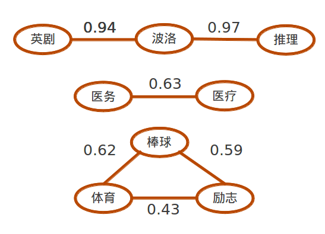

>- 豆瓣电影中的标签
  - 
>- 豆瓣音乐中的标签
  - 
>- 豆瓣阅读中的标签
  - 

---
## 什么是标签

>- 用户主动生成
>- 对文字内容不加限制
>- 是对物品有益的补充说明信息
>- 英文里称这样的东西叫做**folksonomy**(folk+taxonomy)，并不是*tag*

---

## 标签无处不在

除了豆瓣，其实还有很多地方出现了标签：

>- 新浪微博中的标签
  - 
>- 统计之都中的标签
  - 

---

## 能够做什么？

如果我们利用了物品的标签，就可能可以：

>- 更好地细分用户兴趣
>- 更好地刻画物品特征
>- 实现跨种类推荐
>- 向用户推荐标签
>- ……

--- #ending

## 但是……

---
## 数据有噪音！

会有千奇百怪的噪音：

>- /笑--快乐
>- 不用動腦筋但看得很快樂
>- ★★★★★★★☆
>- \\\\\\\\\\\\\\\\\\\\\\\\\\\\\\\\\\\\\\\\\\\\\\\\\\\\\\\\\\\\\\\\\\\\\\\\\\\\\\\\\\\\\\\\\\\\\\\\\\\\\\\\\\\\\\\\\\\\\\\\\\\
>- 图图珍藏之不能忽视的好片
>- 恩..........
  
----
>- **在我们梦想美好的未来之前，要先清洗数据**

---- #ending

## 标签的清洗

----

## 标签的清洗

我对电影标签的清洗步骤：

>- 去掉含有非汉字符号的标签。
>- 将所有繁体字转换成简体字
  - 
>- 抓取物品元信息：即电影的标题、演员、产地等豆瓣已经标记过的内容，并整理成词。
  - 一个比较特殊的情况是外国人名。“迈克尔·杰克逊”我会处理成“迈克尔”，“杰克逊”以及“迈克尔杰克逊”，尽量涵盖可能出现的标签样式；
>- 将出现在元信息中的标签去除。

---
## 标签的清洗

---

## 标签的清洗

>- 去除太长的标签。
>- 从**关联物品数**、**做标记用户数**与**平均被标记数**三个指标上自定义阈值做清理。
  - 
>- 对于稍长的标签（3～5个字），对他们做切分，再在标签内部进行过滤。
  - 例如“经典励志”可以被切成“励志”和“经典”，这是两个已有的标签，那么可以将“经典励志”这个标签去掉。
>- **上面的步骤能去掉超过90%的无用标签，可以准备进入到人工清理的步骤。**

----
## 万事具备？

我以为机器初步清理后, 便可以进行人工清洗了。

可是编辑的反馈居然是这样的：

>- 

----

## 万事具备？

人工清理的一大目的是**去冗余**，比如从一群同义词和近义词中选出一个代表用词。

但是剩下的词还是太多了。

>- 

---- #ending

## 近义词识别

----
## 近义词识别

**假设：意义相近的标签比较容易共同出现在一些物品上。**

举个栗子：

> 医疗剧，医务剧，医疗，医务，医学
    
这些标签常常共同出现在一个物品上。

---
## 近义词识别

---
## 近义词识别

---

## 近义词识别

近义词也不一定要有相同汉字，例如

> 神鬼，玄幻，鬼片，灵异

> 吸毒，大麻，嬉皮，嬉皮士，摇滚

这样的例子还有很多个。

----

## 使用聚类？

经过尝试，用skmeans对于标签来聚类的效果并不好，可能是因为如下的原因：

>- 很难选到合适的距离函数
>- skmeans需要设置聚类的个数；
>- 无论什么聚类方法，**噪音**都会影响效果。

----

## 近义词识别

**关联规则**可以过滤噪音。

LeftHandSide|RightHandSide|Confidence
---|---|---
波洛|英剧|0.9400000
波洛|推理|0.9700000
医务|医疗|0.6377953
医疗|医务|0.5142857
棒球|体育|0.6202532
棒球|励志|0.5886076

这里出现的就是标签之间的关系了，最右边是置信度，即条件概率

    P( RightHandSide | LeftHandSide )
    P( 英剧 | 波洛 ) = 0.94
    P( 推理 | 波洛 ) = 0.97
    etc...

----

## 近义词识别

使用这个置信度构图。

----

## 近义词识别

构建成图之后，我就使用[Gephi](https://gephi.org/)软件进行处理。

利用其计算“模块化”的功能，即**Community Detection**，分析出图中相互关系比较密切的节点。

节点构成了一个个群体，每个群体就是一群近义词了。

----

## 近义词识别

一些效果的展示：

    两性,中产阶级,中年,伦理,出轨,外遇,婚外恋,婚外情,小三,母子,恋母,情迷,艾滋,艾滋病
    医务,医务剧,医学,医疗,医疗剧,美剧
    吉他,吸毒,大麻,嬉皮,嬉皮士,摇滚,摇滚乐,毒品,民谣,颓废,药物,金属,嗑药,飞片儿
    天才,数学,物理,理论,科学,科学家,量子物理,物理学
    平行世界,平行宇宙,平行时空,平行空间,时光倒流,时空穿梭,时空穿越,时间旅行,穿梭时空,穿越,穿越剧,穿越时空

----
## 近义词识别

这样人工清洗就更方便了。

>- 

----
## 清洗之后？

标签是用户对**物品特征的补充说明**

我们一般都是怎么进行描述的呢？

>- 

---- #ending
## 标签的分层

----
## 标签的分层

接下来我们对这些标签建立层次结构。

下图是一个在[del.icio.us](http://del.icio.us)上建立标签树的部分结果：

>- 

----

## 标签的分层

首先，按照标签出现的总次数来衡量标签的抽象程度。

>- 越抽象的标签层级越接近顶层

使用条件概率决定两个标签之间是否有从属关系

>- 一个标签只能**属于**排它之前的标签

>- 当标签**公路**出现时，有
  - 70%的可能性出现**旅行**
  - 60%的可能性出现**开车**
  - 20%的可能性出现**喜剧**
>- 我们就认为**公路**是从属于**旅行**的一个标签

>- 如果一个标签基本不从属于其他的标签，我们就直接将它连接到**根节点**。
  - 是一个独立的概念

----

## 标签的分层

这时候就有了一棵标签树。

----
## 未来的可能应用

惊喜推荐，即防止不断在小范围内推荐物品。

>- 推荐电影：
  - “潜艇”和“国共”都属于“军事”下
  - 所以可以给喜欢看“潜艇”的用户推荐有关“国共”的电影

----
## 未来的可能应用

利用豆瓣“书影音”俱全的特性，进行跨种类推荐：
  
>- 书和电影之间相互推荐：
  - 给经常标记食谱的用户推荐《舌尖上的中国》系列纪录片
>- 日志和书影音相互推荐：
  - 给喜欢《明朝那些事》的读者推荐讨论朱元璋的日志

---
## 参考文献

[Fast unfolding of communities in large networks](http://arxiv.org/pdf/0803.0476v2), [Tool made by the authors](https://sites.google.com/site/findcommunities/ "友情提示，需要科学上网")

[Laplacian Dynamics and Multiscale Modular Structure in Networks](http://arxiv.org/pdf/0812.1770)

[Collaborative Creation of Communal Hierarchical Taxonomies in Social Tagging Systems](http://infolab.stanford.edu/~heymann/taghierarchy.html)

[Evaluating Similarity Measures for Emergent Semantics of Social Tagging](http://www2009.eprints.org/65/1/p641.pdf)

---- #ending

 

## 谢谢！

Contact Me:

> Blog:[Programet](http://blog.programet.org/)

> Email:[hetong007@gmail.com](mailto:hetong007@gmail.com)

> Weibo:[严酷的魔王](http://weibo.com/u/1635976784)

> LinkedIn:[Tong He](http://www.linkedin.com/profile/view?id=236123166)
